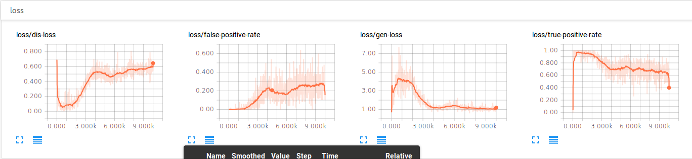
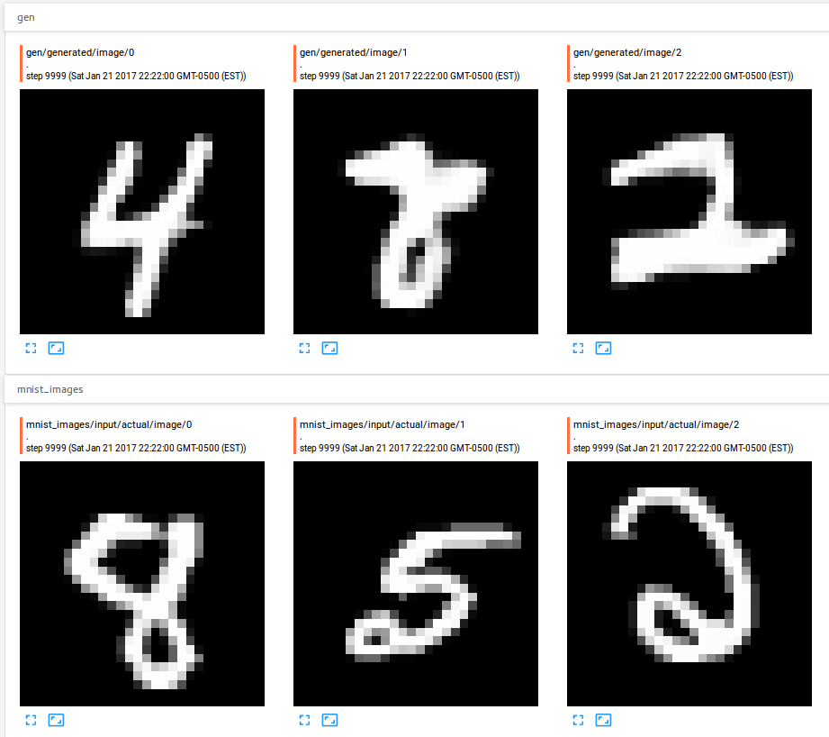

MNIST GAN
=====================================
Ken Leidal (kkleidal@[mit,gmail].com)

A generative adversarial network in which the generator
generates "MNIST-like" images and the discriminator determines
whether an image is from the original MNIST dataset or not.

The architecture comes from https://github.com/osh/KerasGAN,
but I wanted to reimplement it in tensorflow to get tensorflow
experience.  I use slightly different learning rates than in
the original architecture, but overall, this repo makes no
contributions to the original; I just wanted the tensorflow
experience.

Charts for 10K iterations (from left to right: batch loss of the
discriminator, fraction of batch of
generated images classified by discriminator as MNIST images,
batch loss of the generator, and fraction of batch of
MNIST images classified by discriminator as MNIST images):

Examples from final results
(images in first row were generated by the generator,
images in the second row are from the MNIST dataset):

